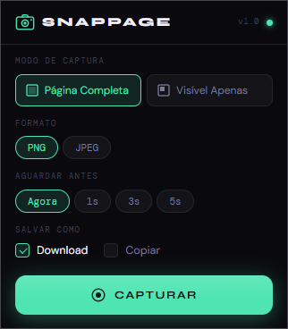

# SnapPage — Full Page Screenshot

> Full page screenshot capture tool for Chrome & Chromium browsers — by Gamuts

---

Desenvolvida pela [Gamuts](https://gamuts.com.br) — apps, ferramentas e jogos digitais independentes.

---

## Instalação

### Via Chrome Web Store

_(em breve)_

### Manual (desenvolvedor)

1. Baixe o [último release](../../releases/latest) e descompacte
2. Abra `chrome://extensions` (ou `brave://extensions`)
3. Ative **Modo do desenvolvedor** → **Carregar sem compactação**
4. Selecione a pasta `src/` descompactada

---

## Funcionalidades

- **Página completa** — captura tudo, incluindo o que está abaixo do fold
- **Visível apenas** — captura somente a área visível na tela
- **PNG ou JPEG** — com slider de qualidade para JPEG (10–100%)
- **Delay configurável** — 1s, 3s ou 5s antes de capturar (útil para hover states e animações)
- **Download** com nome automático: `titulo-da-pagina_2026-05-31_14-22-05.png`
- **Copiar para clipboard** — cola direto no Figma, Notion, onde quiser
- **Prévia** — visualiza a captura com dimensões antes de decidir o que fazer
- **Persistência** — suas configurações são lembradas entre sessões

---

## Compatibilidade

| Navegador             | Suporte                |
| --------------------- | ---------------------- |
| Chrome                | ✅                     |
| Brave                 | ✅                     |
| Edge                  | ✅                     |
| Opera / Vivaldi / Arc | ✅                     |
| Firefox               | ❌ (API diferente)     |
| Safari                | ❌ (sistema diferente) |

---

## Como funciona

Usa a **Chrome Debugger API** com `Page.captureScreenshot` e `captureBeyondViewport: true` — o mesmo mecanismo interno do DevTools. O Chrome renderiza a página inteira sem precisar rolar nada.

> Durante a captura aparece brevemente a barra "DevTools conectado". É normal e desaparece em menos de 1 segundo.

---

## Roadmap

- [x] v1.0.0 — MVP: captura completa, formatos, delay, download, clipboard, persistência
- [ ] v1.1.0 — Atalho de teclado + formato WebP + captura em 2× (alta resolução)
- [ ] v1.2.0 — Captura por elemento: hover destaca o div, clique captura exatamente aquele bloco
- [ ] v1.3.0 — Seleção livre com handles ajustáveis nos cantos
- [ ] v1.4.0 — Anotações pós-captura (seta, retângulo, texto)
- [ ] v1.5.0 — Chrome Web Store

---

## Licença

[PolyForm Noncommercial](LICENSE) — use e modifique livremente para fins pessoais e não-comerciais. Monetização não é permitida. Para uso comercial, entre em contato.

---

## Contato

Dúvidas, sugestões ou feedback:

- Site: [gamuts.com.br](https://gamuts.com.br)
- E-mail: [contato@gamuts.com.br](mailto:contato@gamuts.com.br)
- Issues: [github.com/gamutsbr/snappage/issues](https://github.com/gamutsbr/snappage/issues)

---

_Feito com atenção pela [Gamuts](https://gamuts.com.br)_
